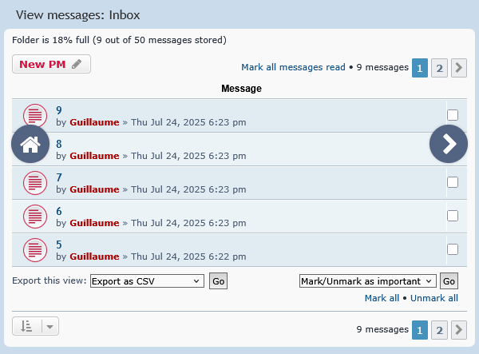

# Swipe Gestures Navigation for phpBB
by ltGuillaume: [Codeberg](https://codeberg.org/ltguillaume) | [GitHub](https://github.com/ltguillaume) | [Buy me a beer](https://coff.ee/ltguillaume) 🍺

## Overview
A phpBB extension that allows you to swipe left/right to open the next/previous page in forums, topics and private messages.

On page 1 or anywhere non-paginated, you'll be able to swipe right to get back to the index. Inside a topic, swiping right on the first page will bring you back to the topic's forum.

Browser history for previous/next page gestures is not recorded, so you can get out of a topic/forum more easily with the browser's back button or an OS swipe gesture.



## Usage
The idea is to allow for pagination gestures just like you're used to on e.g. your Gallery app.

Just like in a PDF reader or gallery app, start the swipe gesture away from the edges of the display, as you may otherwise trigger the native swipe gesture instead.

- Swipe left and the indicator as shown on the right of the screenshot will show up. Lift your finger and the next page is loaded. Or swipe back to the right to cancel the gesture (the indicator will disappear again).
- Swipe right and the indicator as shown on the left of the screenshot will show up. Lift your finger and you'll navigate back to the forum index. Or swipe back to the left to cancel the gesture (the indicator will disappear again).
- If you're on page 2 or higher, the swipe right indicator will show a `<` chevron and you'll navigate to the previous page instead.

## Installation
1. [Download the latest release](https://codeberg.org/ltguillaume/phpbb-swipenav/releases/latest) or use `git clone https://codeberg.org/ltguillaume/phpbb-swipenav.git`
2. Copy the folder `ltguillaume` into the `ext` folder of your phpBB installation
3. In the Administration Control Panel, open the tab `Customise` and enable `Swipe Gestures Navigation`

## Colors
You can alter the colors of the indicators by either changing the values of the color variables inside `swipenav.css`, or by adding the following with your own colors to the main CSS file of your theme(s):

```
:root {
	--swipe-background: #536482 !important;
	--swipe-border: #0003 !important;
	--swipe-color: white !important;
}
```

## Factor
If you feel the distance to swipe for the indicators to show up should be tweaked, you can alter the `factor` value inside `swipenav.js` (higher to increase sensitivity, lower to decrease it).

## Credits
- [Gesture swipe icon](https://icon-icons.com/icon/gesture-swipe/102917) by [Iconshock](http://www.iconshock.com)